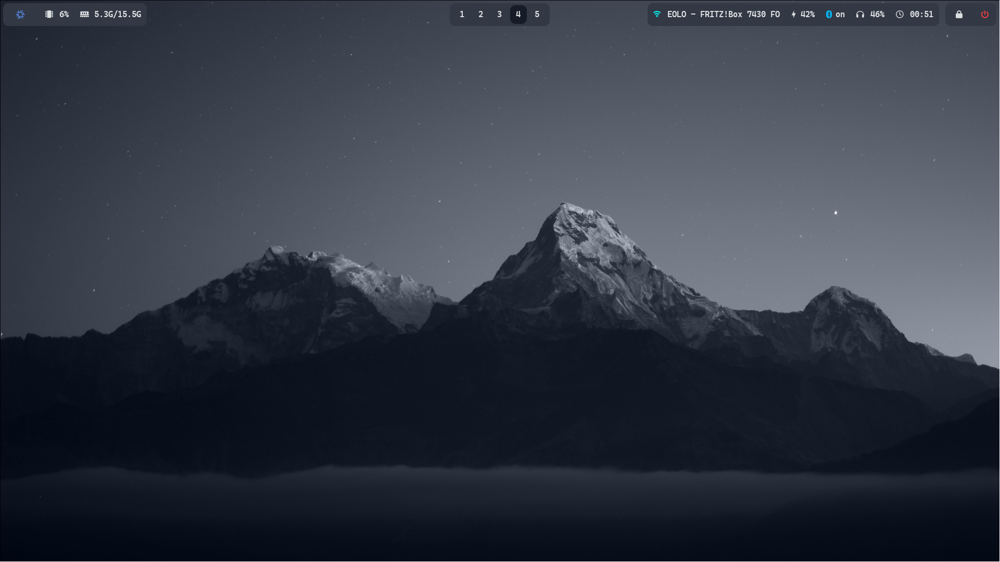
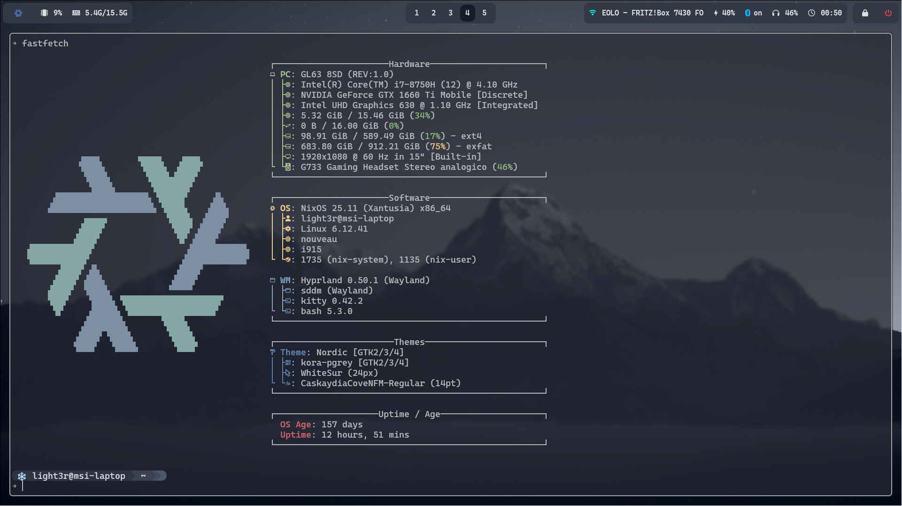
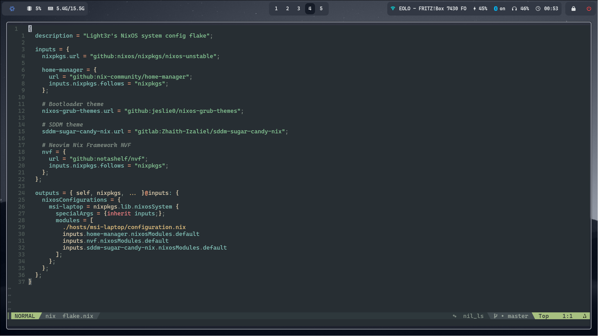
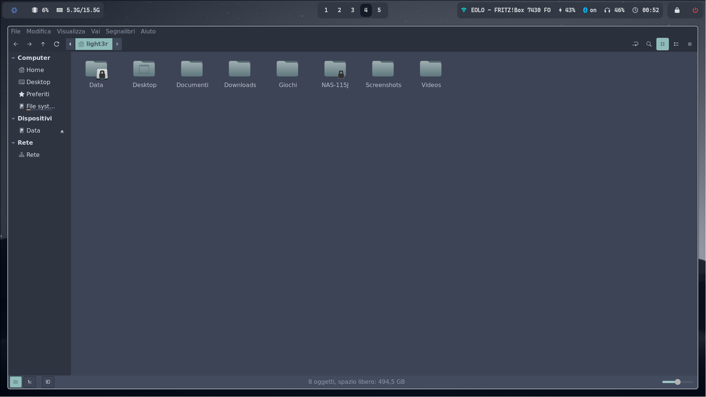

# Light3r's NixOS configuration 
Hello everyone, this is my personal NixOS system configuration. I've switched from Windows 11 in February 2025, so I'm still new to the ecosystem.

🔴 NOTE: DO NOT deploy this flake directly on your machine, it will not succeed. This flake contains my hardware configuration and other individual information 
(such as hardware-configuration.nix) which are not suitable for your configuration. You're free to use the repo as a reference to build your own configuration.
If you're an experienced user, all suggestions are welcome.

## Configuration Sneak Peek

## What's included
The configuration is packed in a flake which contains both NixOS system-level configuration along with user-level (mostly dotfiles) configuration managed through Home Manager

__Components__
|Functionality           |Program         |
|------------------------|----------------|
|Window Manager          |Hyprland        |
|Terminal Emulator       |Kitty           |
|Status Bar              |Waybar          | 
|Application Launcher    |Rofi            |
|Notification Daemon     |SwayNC          |
|Display Manager         |SDDM            |
|Theme                   |Nordic          |
|System resource monitor |Btop            |
|File Manager            |Nemo + Yazi     |
|Shell                   |Bash + Starship |
|Text Editor             |Neovim          |
|Media Player            |Mpv             |
|Image Viewer            |Qimgv           |
|Screenshot Software     |Hyprshot        |
|Screen Recording        |OBS Studio      |
|Filesystem              |Ext4            |
